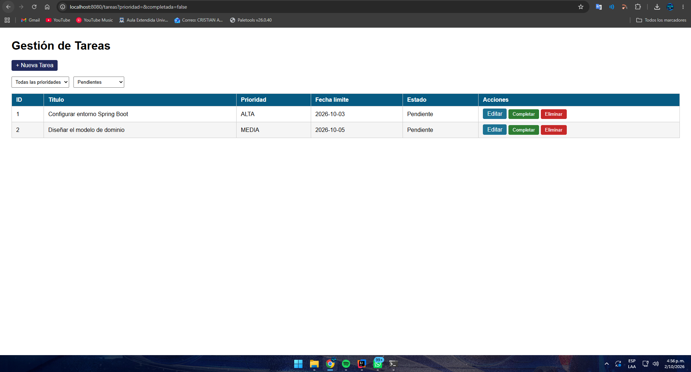
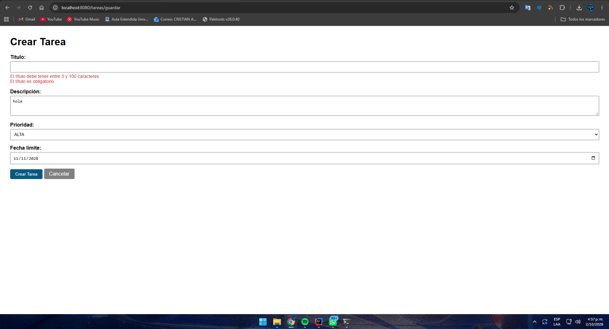
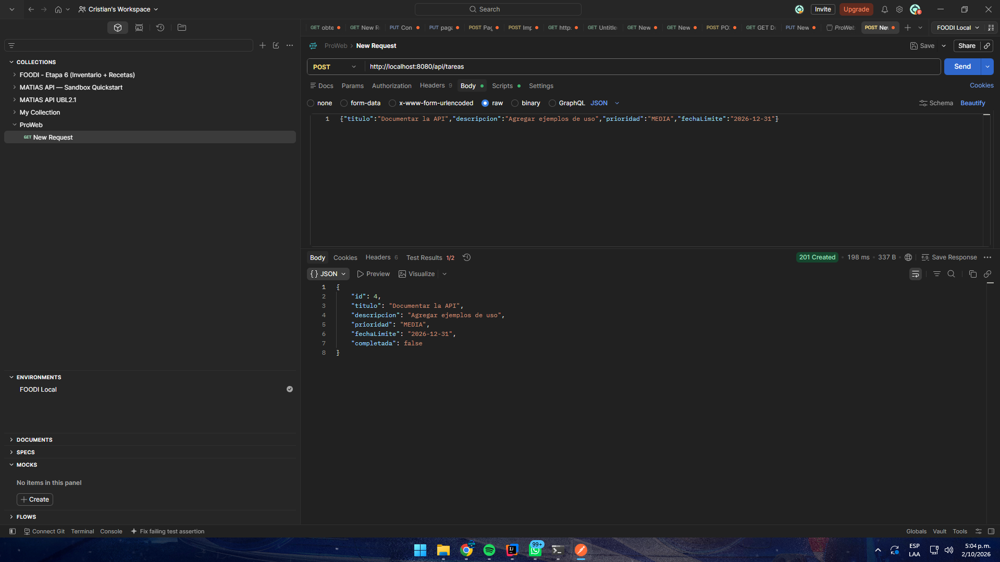
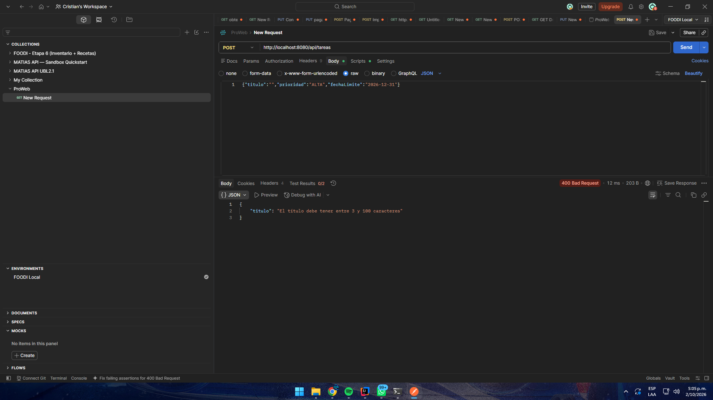
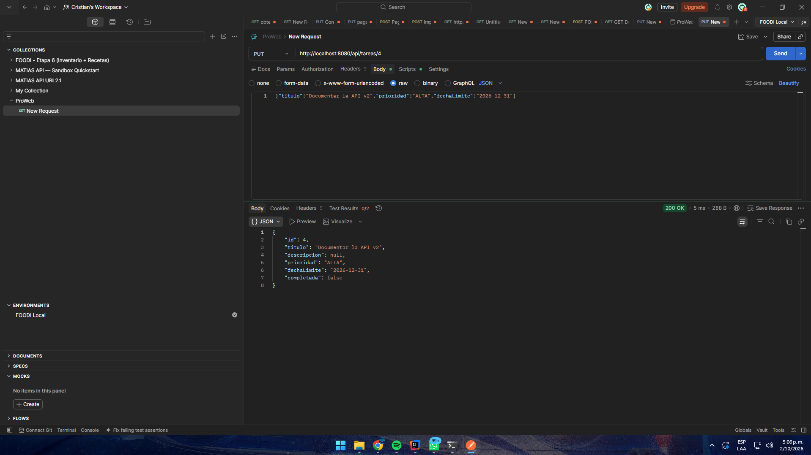

# Post-contenido — Unidad 7: Gestión de Tareas con Spring Boot

**Autor:** Cristian Alonso Peñaranda Parra
**Curso:** Programación Web — Universidad de Santander (UDES)

## Descripción
Repositorio del laboratorio de la Unidad 7 de Programación Web.
Un único proyecto Spring Boot (`gestion-tareas`, paquete raíz
`com.universidad.tareas`) con dos capas sobre el mismo `TareaService`:
una vista Thymeleaf (`@Controller`, Parte 1) y una API REST
(`@RestController`, Parte 2). Ambas capas comparten los mismos datos en
memoria.

**Tecnologías:** Java 17, Spring Boot 3.5, Spring Web, Thymeleaf,
Bean Validation, Maven.

## Prerrequisitos
- JDK 17 o superior en el PATH.
- Maven 3.8+ o el wrapper `mvnw` incluido en el proyecto.
- IntelliJ IDEA (o VS Code con Extension Pack for Java).
- Navegador web y Postman (o curl) para probar la API.
- Git.

## Parte 1 — Vista Thymeleaf con @Controller
`TareaController` expone `/tareas` con filtrado por `@RequestParam`
(prioridad y completada), formularios validados con `@Valid` y
`BindingResult`, y las acciones completar y eliminar implementadas como
POST (no GET), con el patrón Post/Redirect/Get.




## Parte 2 — API REST con @RestController
`TareaApiController` expone `/api/tareas` con los verbos GET, POST, PUT,
PATCH y DELETE, inyectando por constructor la misma instancia de
`TareaService` que usa la Parte 1. `ApiErrorHandler` traduce los errores
de `@Valid` en JSON estructurado (400 Bad Request), en lugar de la página
de error HTML por defecto de Spring Boot.





### Endpoints de la API

| Método | URL | Éxito | Error | Descripción |
|---|---|---|---|---|
| GET | `/api/tareas` | 200 OK | — | Lista de tareas, filtrable con `?prioridad=` y `?completada=`. |
| GET | `/api/tareas/{id}` | 200 OK | 404 | Retorna la tarea con el ID indicado. |
| POST | `/api/tareas` | 201 Created | 400 | Crea una tarea; 400 si falla la validación. |
| PUT | `/api/tareas/{id}` | 200 OK | 404 / 400 | Reemplaza todos los campos de la tarea. |
| PATCH | `/api/tareas/{id}/completar` | 200 OK | 404 | Marca únicamente `completada = true`. |
| DELETE | `/api/tareas/{id}` | 204 No Content | 404 | Elimina la tarea. |

## Decisiones de diseño
- **Inyección por constructor (no `@Autowired` en campo)** en ambos
  controladores: hace explícita la dependencia y permite instanciar la
  clase en una prueba unitaria sin levantar el contexto de Spring.
- **`@FutureOrPresent` en lugar de `@Future` en `fechaLimite`:** permite
  tareas con vencimiento el mismo día de su creación.
- **`@DateTimeFormat(iso = ISO.DATE)` en `fechaLimite`:** el campo
  `<input type="date">` envía y espera el formato `yyyy-MM-dd`, que no
  coincide con el formato por defecto del idioma del servidor.
- **POST (no GET) para completar y eliminar en `TareaController`:** una
  petición GET debe ser segura; de lo contrario, el prefetch del
  navegador o un rastreador podría modificar datos al visitar un enlace.
- **PATCH (no PUT) para `/api/tareas/{id}/completar`:** representa una
  actualización parcial de un único campo; PUT obligaría al cliente a
  reenviar el recurso completo.
- **Validación separada por capa:** `BindingResult` para la vista HTML
  (re-renderiza el formulario con los mensajes) y
  `@RestControllerAdvice` para la API (devuelve JSON); cada capa responde
  en el formato que le corresponde.
- **Un solo `TareaService` singleton:** la vista y la API leen y escriben
  los mismos datos; no existe un servicio ni un modelo paralelo.
- **Campo oculto `completada` en el formulario:** evita que al editar una
  tarea completada se pierda su estado.
- **Persistencia en memoria (`Map` en `TareaService`) en lugar de
  JPA/Hibernate:** la persistencia real se introduce en la Unidad 8.

## Cómo compilar y ejecutar
1. Clonar el repositorio:
   `git clone https://github.com/CristianPrnda/penaranda-post1-u7.git`
2. Abrir la carpeta como proyecto Maven en IntelliJ IDEA.
3. Ejecutar `./mvnw spring-boot:run` (o la clase `TareasApplication`).
4. Vista web: http://localhost:8080/tareas
5. API REST: http://localhost:8080/api/tareas (probar con Postman o curl).

## Estructura
```
penaranda-post1-u7/
├── pom.xml
├── mvnw
├── README.md
├── capturas/
└── src/main/
    ├── java/com/universidad/tareas/
    │   ├── TareasApplication.java
    │   ├── model/        (Tarea, Prioridad)
    │   ├── service/      (TareaService)
    │   └── controller/   (TareaController, TareaApiController, ApiErrorHandler)
    └── resources/
        ├── application.properties
        └── templates/tareas/   (lista.html, formulario.html)
```